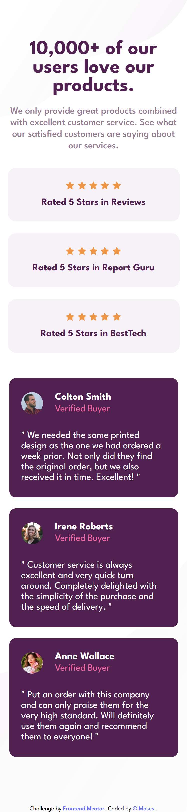

# Frontend Mentor - Social proof section solution

This is a solution to the [Social proof section challenge on Frontend Mentor](https://www.frontendmentor.io/challenges/social-proof-section-6e0qTv_bA). Frontend Mentor challenges help you improve your coding skills by building realistic projects.

## Table of contents

- [Overview](#overview)
  - [The challenge](#the-challenge)
  - [Screenshot](#screenshot)
  - [Links](#links)
- [My process](#my-process)
  - [Built with](#built-with)
- [Author](#author)

## Overview

### The challenge

Users should be able to:

- View the optimal layout for the section depending on their device's screen size

### Screenshot

### Links

- Solution URL: [social-proof-section](https://github.com/mbtenkorang/social-proof-section)
- Live Site URL: [social-proof-section-website](https://social-proof-section-fem.onrender.com/)

## My process

### Built with

- Semantic HTML5 markup
- Flexbox
- CSS Grid
- Mobile-first workflow
- [Vue](https://vuejs.org/) - JS library
- [Vite](https://vitejs.dev/) - For bundling

## Author

- Website - [GitHub Repo](https://github.com/mbtenkorang)
- Frontend Mentor - [@mbtenkorang](https://www.frontendmentor.io/profile/mbtenkorang)
